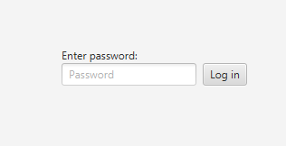
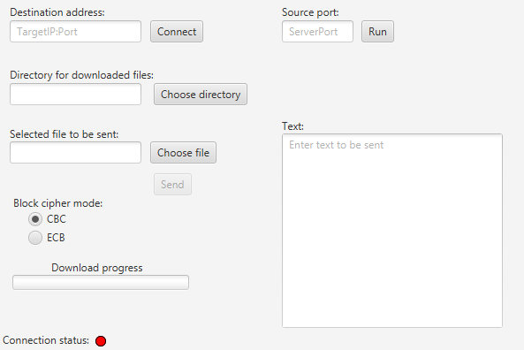

# CipherChat

CipherChat is a Java-based project that utilizes the Maven build system and JavaFX library. The application allows users to communicate and exchange data between computers in a secure way using the RSA algorithm to generate keys, SHA-256 to create a hash of user passwords, and AES to encrypt data. Implementations of all cryptographic algorithms used in the application were taken from the `javax.crypto` library. Communication is established using the TCP protocol. Every message is prepended by sending an encrypted message header. Communication is bidirectional. The encrypted messages are split into 1024-byte chunks, which are sent synchronously.

### Login View

This is the login screen where users enter their password to access the application.

### Chat View

This is the main chat screen where users can send and receive encrypted messages and files.

### Prerequisites

- Java Development Kit 17 (JDK)
- Maven

## Project Structure

The project is structured as follows:

- `src/main/java/pl/projekt/bsk`: This is the main package of the project. It contains the main classes and controllers for the application.
- `src/main/java/pl/projekt/bsk/connection`: This package contains classes for establishing a connection between the client and the server. It also handles the sending and receiving of messages.
- `src/main/java/pl/projekt/bsk/utils`: This package contains utility classes for encryption and decryption.

## Key Classes

- `EncryptionUtils`: This class provides various static methods for encryption and decryption tasks.
- `LogInController`: This class handles the login functionality of the application.
